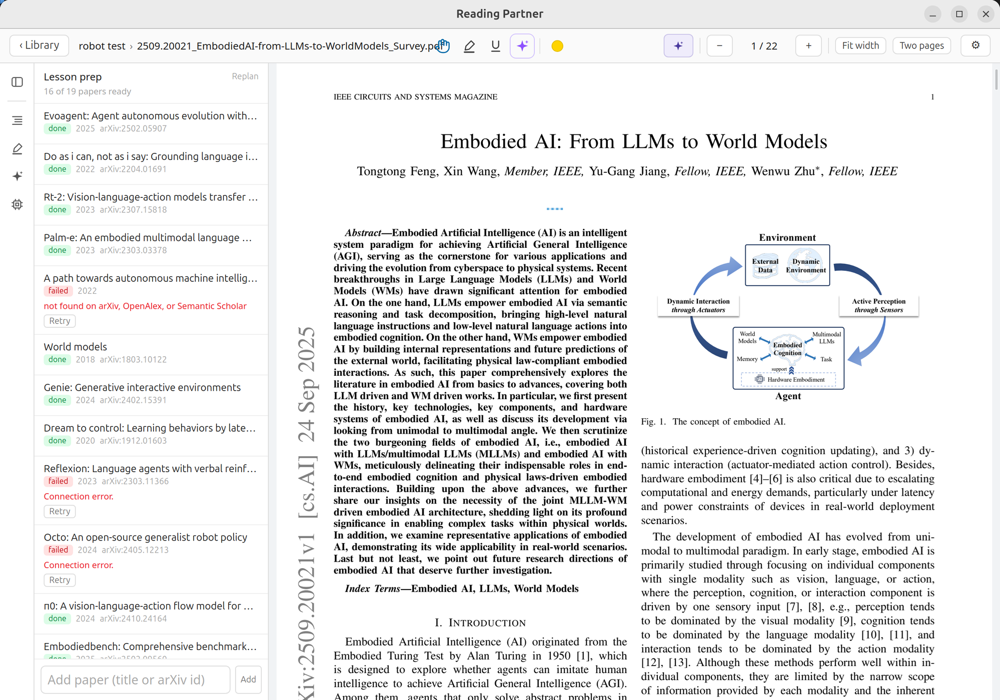
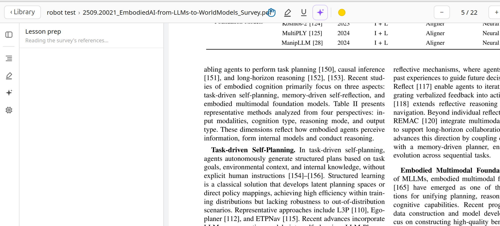
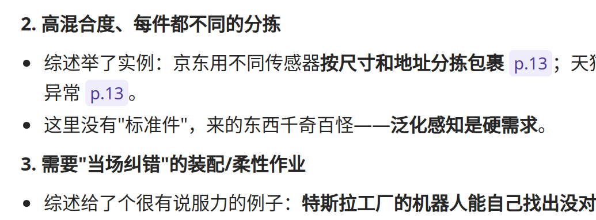

# Reading Partner

An AI reading companion for academic surveys and technical books. It doesn't just chat next to your PDF — it reads the same book you do, prepares lessons from the papers the book cites, remembers what you understood and where you got stuck, and teaches with citations you can click to jump back into the text.



Local-first and backend-free: sign in with your Claude or ChatGPT subscription, or use a DeepSeek API key. Books, annotations, notes, memory, and credentials never leave your machine.

## Daily briefing

The app opens to a Today home: cards to continue the book you were reading, and a briefing of the day's news from the sources you subscribed to. There are no built-in sources — on first run the AI opens a short conversation to learn what you follow and help you add the first few.

Subscribing is a conversation. Name an outlet or paste a link and the AI probes it for a usable feed, fetches three sample articles as a trial, and subscribes only after you confirm — each source is a small declarative JSON descriptor the AI writes and proves by actually fetching, so it can connect a site with no obvious feed. Read articles in-app with their images, and open a chat anchored to any item to dig in.

The AI reads every item in full and triages it against your reading profile: worth reading (each with a one-line reason it's for you), one-liners, out-of-lane, and filtered-out noise (appealable when it drops something you wanted). Your open, dismiss, and appeal actions feed the next day's triage.

Every briefing carries a companion chat. Ask what came in today, get per-source or filtered breakdowns, and voice a standing preference ("be harsher on vendor PR", "keep the paper explainers") — the AI drafts a profile change you Apply from a confirm card. Ask it to redo the briefing and it re-triages today's items against the updated profile, or re-collects every source from scratch; a progress card tracks the run to completion. The briefing is written in your configured AI output language.

## Reading profile

One profile — four short sections (interests, taste, background, what you're reading now) — steers both the briefing's triage and the reading companion, and syncs across devices. Nothing is preset: the AI drafts and revises it only from preferences you actually voice, always through a confirm card you Apply. What you have open and the questions you got stuck on feed into how relevant the briefing judges each item.

## Two modes

**Companion mode** — you drive. Mark a passage with the AI pen and it explains it in place, like a video call with the book: the reply opens in a bubble you can expand, and the thread stays anchored to your highlight forever. The AI can turn pages on its own, run full-text search across the books in your topic, and read your existing highlights and notes when the conversation needs them. A button in the top bar opens a book-level thread for questions that belong to no particular passage ("what is this chapter about?").

**Classroom mode** — the AI drives. Toggle it inside any conversation and the AI switches from companion to teacher: the entire survey stays resident in its context, together with lesson notes it prepared for the papers the survey actually leans on. The toggle is remembered per book.

## Lesson prep

When you open a survey, the AI reads it, picks the 15–20 load-bearing citations, and prepares them in the background:

- Full texts come from arXiv first, then [OpenAlex](https://openalex.org) (no key needed), then Semantic Scholar (optional free API key in Settings avoids the shared rate pool).
- Each paper is digested by an agent loop into a lesson note — short papers in one pass, long ones by turning pages with the same tools you see in chat.
- The prep panel in the sidebar shows every paper's status; you can skip, retry, replan, or add papers by title, arXiv id, or URL.
- Preparation is lazy and chapter-driven: papers cited by the chapter you are reading get prepared first. Everything is resumable across restarts.



## Citations you can click

The AI cites what it teaches. Page references render as chips — click one and the reader jumps to the page, with the exact quoted sentence flashed as a transient violet highlight so you see precisely what was referenced. Figures render as inline cards cropped from the actual page (vector diagrams included); click to jump, or ask about a figure and the AI will look at the image itself through its vision tool.



## Memory

When you hang up a conversation, the AI silently distills it: where you are in the book, what you now understand, where you were stuck, what you corrected it about. One fact per file, on your disk, inspectable in the sidebar's Memory tab. The next conversation opens with a snapshot — the AI knows you read to section 4.2, struggled with the KV cache last week, and resolved it. Corrections happen in conversation ("you remembered that wrong") rather than by editing files.

## Feed it links

Paste a URL into the chat — an arXiv or OpenReview PDF, or a web article — and the AI ingests it: downloads, extracts, files it into the prep list, and can discuss it against the survey in the same turn. The survey is static; the field is not.

## Whole-book notes

The sidebar has a Notes tab: one click generates chapter-by-chapter lecture notes for the whole book. The chapter plan comes from the PDF outline, or the model reads the table of contents when there is none. Notes carry `[p.N]` and `[fig:N]` anchors that jump into the book, just like citations in chat. Regenerate any chapter on its own, with an optional instruction to steer it. Your highlights and conversations in a chapter shape how deep its note goes, and explanations you explicitly endorsed in chat get absorbed into the note.

Notes also accrue as you read: a chapter distills into its note once your highlights move past it, chapters you never marked are skipped, and a final pass runs when you close the book. The notes overview is part of the context each conversation opens with, so the AI knows what the book has already covered.

## Slides from notes

Turn your book notes into a self-contained HTML slide deck for a talk — multiple books at once, with optional AI-drawn illustrations. It opens in any browser with everything inlined, nothing to serve.

## Voice input

Every chat composer has a push-to-talk mic. Hold to record, release to transcribe: recording runs in Rust (WebKitGTK's getUserMedia is unreliable on Linux), speech-to-text goes through any OpenAI-compatible endpoint, and an LLM pass cleans up the transcript. It defaults to SiliconFlow's free SenseVoice tier — add a SiliconFlow key in Settings.

## Sync across devices

Sign in with Google in Settings and everything syncs — books, reading positions, marks and highlights, conversations, and notes — through a visible "Reading Partner" folder in your own Google Drive. No accounts, no server: your data stays in your Drive, and you can open the folder and see the files. Sync runs automatically after sign-in, with a manual toggle and a Sync now button in Settings. Books are content-addressed, so the same PDF opened on two devices lines up. AI provider credentials are the one thing that never leaves the device.

## Thinking levels

Adaptive reasoning is on by default: low effort for conversation (fast answers, the model thinks only when the question demands it), medium for lesson prep (background work, quality first). Both are adjustable in Settings.

## Install

Prebuilt binaries for Linux, macOS and Windows are on the [releases page](https://github.com/Einstellung/Reading-Partner/releases). They are unsigned: macOS will refuse the first launch until you right-click the app and choose Open, and Windows SmartScreen will warn once.

First run: open Settings and connect one provider — Sign in with ChatGPT or Sign in with Claude uses your subscription through an OAuth flow in the browser (no API key), or paste a DeepSeek API key. Only one provider is active at a time; connecting one signs the others out. Optionally add a Semantic Scholar API key for lesson prep and a SiliconFlow key for voice input. The AI's output language is set here too and governs chat, notes, slides, and the briefing — nine languages, or auto to follow the language you write in. With no sources yet, the AI starts a guided conversation to help you subscribe to your first few.

## Build

Prerequisites: Bun, Rust stable, and the [Tauri 2 prerequisites](https://tauri.app/start/prerequisites/).

```sh
git clone git@github.com:Einstellung/Reading-Partner.git
cd Reading-Partner

bun install
bun run wasm   # stage the self-hosted PDFium wasm (from the @embedpdf/pdfium package, offline)
bun run tauri dev
```

Drive sync needs your own Google OAuth Desktop client: copy `.env.example` to `.env` and fill in `VITE_GOOGLE_CLIENT_ID` / `VITE_GOOGLE_CLIENT_SECRET`. Without it the app runs fine, with sync disabled.

`bun test` runs the suite (no network, no AI tokens). An iOS/TestFlight pipeline is prepared in `.github/workflows/ios-testflight.yml`.

## Architecture

- `src/reader-embedpdf/` — the engine adapter: assembles EmbedPDF's headless core + plugins, renders from in-memory bytes, and converts annotations at the boundary (the shell persists its own JSON schema). All UI around it (toolbar, annotations list, AI) is the shell's.
- `public/pdfium/pdfium.wasm` — the PDFium engine binary, self-hosted (gitignored; staged by `bun run wasm` from the npm package, no CDN at build or runtime).
- `src/ai/` — provider streaming and the agent tool loop. `src/prep/` — the lesson-prep pipeline. `src/memory/` — the per-topic memory store. `src/figures/` — figure extraction and rendering. `src-tauri/` — Tauri 2 app.
- Design consensus documents (in Chinese) live in `docs/`; hard-won engine/Tauri surprises are indexed in `docs/pitfall/`.

## Status

Early development, PDF only, moving fast. The screenshots above come from real reading sessions and may lag behind the current interface.

## License

[AGPL-3.0](./LICENSE). The PDF engine is [EmbedPDF](https://github.com/embedpdf/embed-pdf-viewer) (MIT), which renders through [PDFium](https://pdfium.googlesource.com/pdfium/) compiled to WebAssembly (Apache-2.0).
