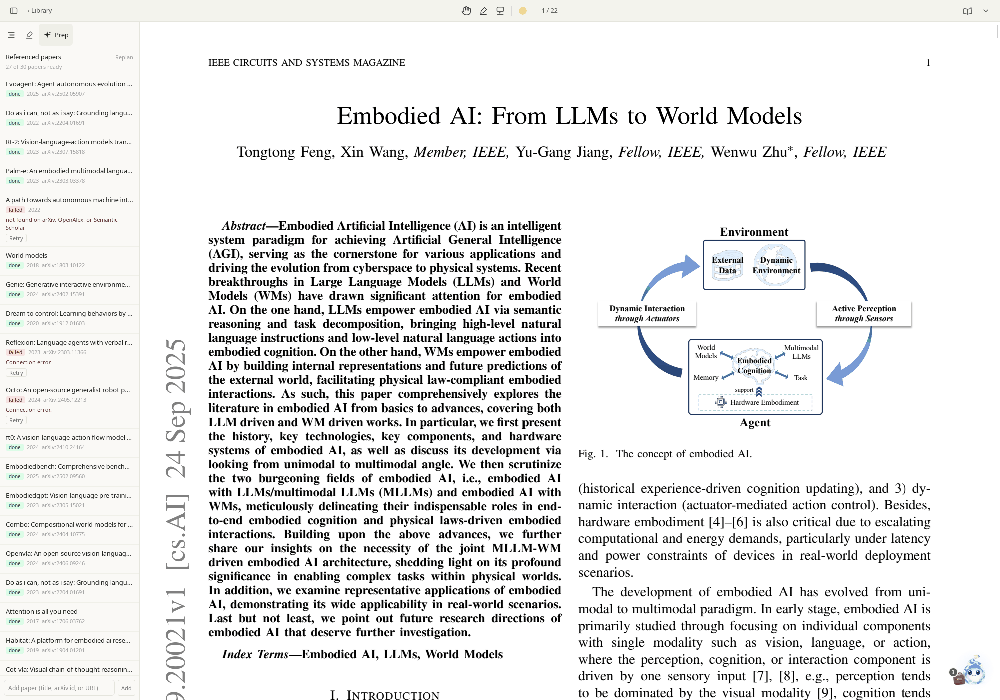
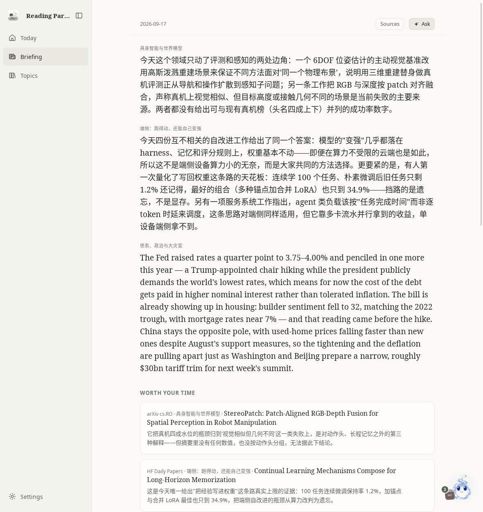
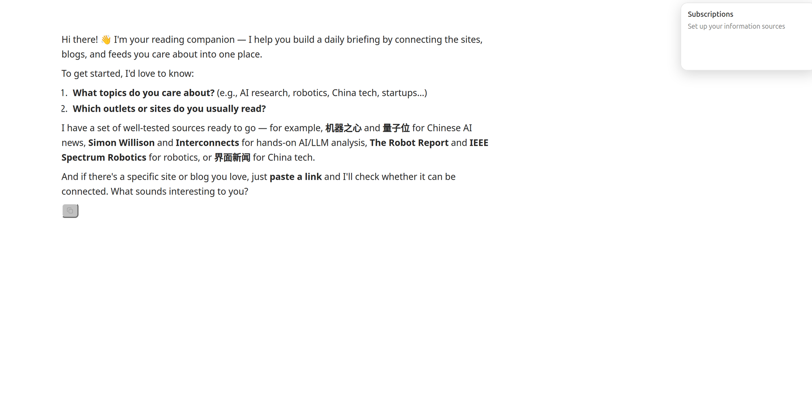
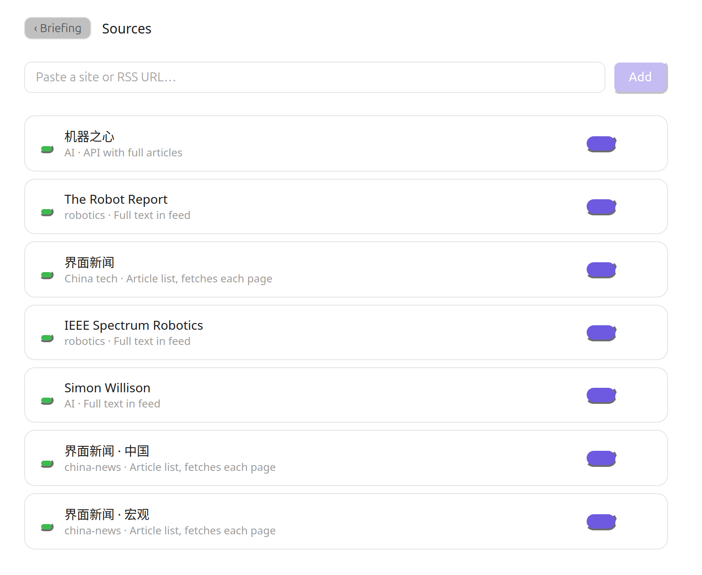
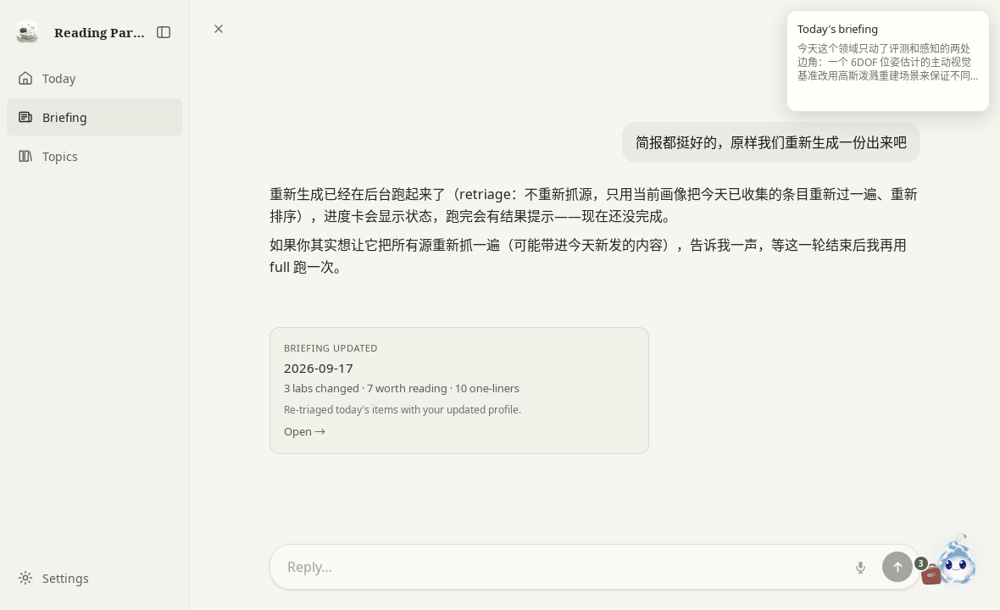
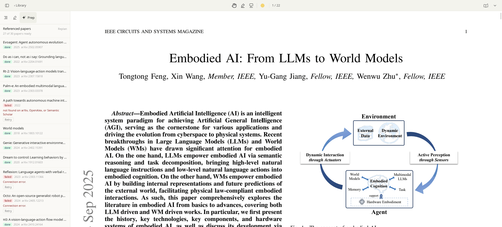
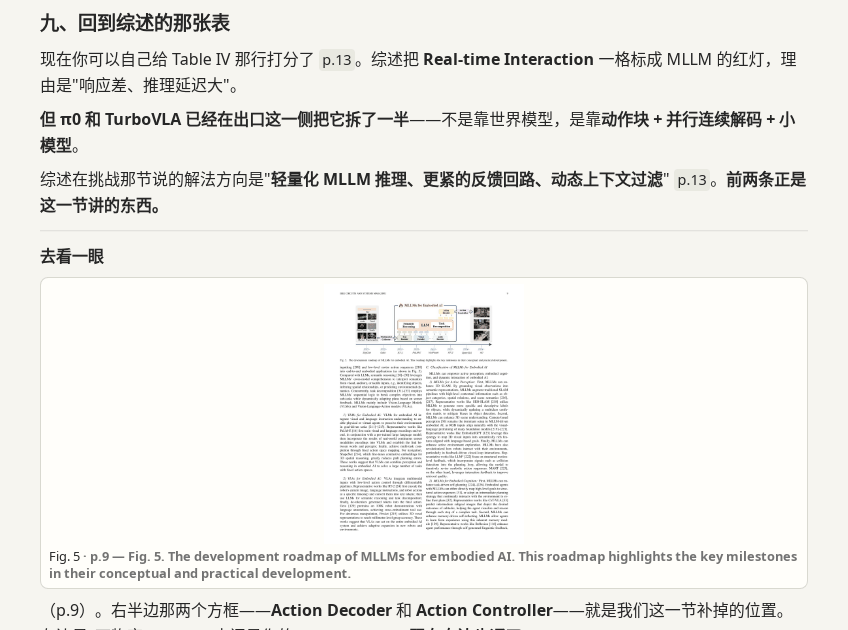

# Reading Partner

An AI reading companion for academic surveys and technical books. It doesn't just chat next to your PDF — it reads the same book you do, prepares lessons from the papers the book cites, remembers what you understood and where you got stuck, and teaches with citations you can click to jump back into the text.



It reads the day's news for you too: the sources you subscribe to, screened and triaged into one finite briefing instead of a feed.

Local-first and backend-free: sign in with your Claude or ChatGPT subscription, or use a DeepSeek API key. Books, annotations, notes, observations, and credentials never leave your machine.

## Two machines

The desktop app collects. The phone app reads what it collected.

Collecting means polling every source around the clock, opening article pages in a real browser engine, and running the AI passes that judge them — tens of seconds per article, all day. A backgrounded phone gets seconds of runtime at a time, so iOS and Android are readers and are not offered the choice. Every desktop starts as a collector and can be switched to reader in Settings; when several are signed into the same account, one of them collects and the others don't, so you never pay twice for the same day.

The collector publishes the finished briefing and the text of the articles in it into your Drive folder, and every reader picks them up from there. On a reader, asking for a fresh briefing hands the request to the collector rather than running it locally. Subscribing to a source and signing in to a site are the collector's too, because both have to prove they can actually fetch an article before they mean anything.

A phone with no desktop behind it gets an app with no briefing in it.

## Daily briefing

The app opens to a Today home: one card to continue the book you were reading, one for the day's briefing. The briefing is a finite document you read top to bottom, sorted into four tiers, with a clear end.

The AI reads every item that survives the funnel and sorts each into exactly one tier against your reading profile:

- Worth your time — two to four items that earn opening, each with a one-line reason written to you and referencing your interests, not generic praise.
- In one line — the items worth knowing but not opening; the line carries the actual news, what happened and the number that matters, so reading it is the whole point.
- Out of your lane — at most one deliberate anti-echo-chamber pick: something important you would not normally follow, labeled and set apart. On a day with no honest candidate there is none.
- Filtered — everything else, collapsed to a tally ("vendor PR ×8, conference recap ×6") that expands to the dropped titles, each with a Show anyway.

A one-line overview opens the page and is allowed to say the day is mostly noise. When the same story runs in more than one outlet — including a Chinese source and an English one reporting the same event — triage keeps one entry, names both outlets, and files the rest as duplicate coverage.

Underneath, a day is a funnel. Each source is polled on its own schedule — a feed holding twenty items for six hours gets visited every few hours, one holding three weeks gets visited daily — and the headlines accumulate in a pool, so a busy outlet doesn't scroll past between briefings. Building the briefing then runs four phases: discover, screen every headline for whether it is worth fetching at all, fetch only the survivors, triage those. The two expensive steps see dozens of items instead of hundreds, which is what stops a day's cost from tracking how much you subscribe to. Screening judges each item on its own with no quota — it may keep a whole batch or drop one — and when the daily cap does bite, the number it left out is printed on the card, in the progress line, and in the briefing.

There is no Generate button. The collector builds the day's briefing on its own and the way to ask for another is to say so to the companion.

Read any item in the app: a clean typographic page with its images. Keep one and it is stored whole, and shows up in the Saved list on your phone. Your reactions feed back — opening, dismissing, and appealing a filtered item are logged and shown to the next day's triage, so it learns your taste over time. The overview, reasons, and one-liners are written in your configured AI output language, even when the source article is in another.



## Subscribe by talking

There are no built-in sources. On first run the AI introduces itself and asks what you follow — one or two questions at a time, digging before it proposes anything, never dumping a list. It suggests outlets from its own knowledge only once a concrete interest has surfaced.

Adding a source is a conversation. Name an outlet or paste a link, and the AI scouts the site — reading a homepage's navigation to find the real URL of the channel you meant — then probes it for a usable feed: trying the common paths, detecting RSS/Atom/RDF/JSON, judging whether the feed carries full text or only summaries, and telling a server-rendered list page from a browser-only app when there is no feed. It then fetches sample articles as a trial. A confirm card shows the titles with their character counts and whether the full body came back, and the AI subscribes only after you say yes.

Each source is a small declarative JSON descriptor — how to discover its items, where the body text comes from, how often to poll it — that a generic engine runs. The AI writes or adapts it (a new URL, a tweaked link pattern, a same-site shape cloned) and proves it by actually fetching, so a wrong draft simply fails at the trial and the AI tells you. This connects sites that have no obvious feed.

The Sources page is the account of what you subscribe to: one row per source with its lane and pipe type, an on/off toggle, a health dot (green when the last run succeeded, amber when it failed — click for the last-success time and the error), and a delete. A box at the top takes a pasted site or RSS URL and probes, trials, and adds it in place, without going through the chat. There is no ordering or grouping — ranking is triage's job.





## Sources you sign in to

Some sites give an anonymous reader five hundred characters of a story that runs to two thousand for a subscriber. A source can declare that its body text comes from a real browser engine and name the site's own login page; you sign in there yourself, in a window the app opens onto that page. The cookie stays in that window's jar. The app stores no password, fetches on nobody's behalf, and the text it gets goes to your own devices and nowhere else. The Sources page carries a row per site with whether the session still holds, and a check that reloads the front page to find out.

Only Linux can do this today. The hidden window is WebKitGTK's; macOS and Windows answer `unsupported` and a phone has no such command at all. On those hosts the same source still contributes its headlines and standfirst, and the app says the host has no window for the rest, not that the source withheld it.

## The briefing companion

Every briefing carries a chat, and every item has its own Ask that anchors a thread to that article, with its full text and the day's overview in context. The companion sees the whole document, including the full filtered list with each item's category, so it can tell you what came in today, break it down per source, or defend why something was dropped.

Voice a standing preference — "be harsher on vendor PR", "keep the paper explainers", "I care more about robotics now" — and the AI drafts a complete revised profile and shows it on a confirm card. Nothing is saved until you Apply; when today's briefing already exists, applying offers to re-triage it on the spot against the new profile.

Ask it to redo the briefing and it runs one of two depths: a re-triage that re-sorts the day's already-collected items with the current profile (no fetching — for after a profile change or a bad sort), or a full re-collection that polls every source again, including any you just added, and re-triages. It starts a background job and returns at once; a progress card tracks the run — sources discovered, headlines screened, articles fetched, then triage — and settles into the finished briefing. The AI only regenerates when you ask, never on its own.



## Reading profile

One profile in two halves, steering both the briefing's triage and the reading companion, synced across devices.

What you declared — interests, taste, background, what you're reading now — changes only through a confirm card you Apply. Nothing is preset; the AI drafts and revises it from preferences you actually voiced.

The other half is what the AI guesses, and it writes that one itself. Not a reading log — that is on disk already — but a read on why you do what you do: you pick macro-trend investment books and mark the capital-flow passages, so what you are after is a judgment about the era, not a stock-picking method. At most eight guesses, each dated and carrying the one behavior it came from; a guess it cannot source doesn't get written. An automatic write may replace that half and nothing else, and both sides go into prompts labeled for what they are, so a guess is used as a hunch rather than a rule.

## Two modes

**Companion mode** — you drive. Mark a passage with the AI pen and it explains it in place, like a video call with the book: the reply opens in a bubble you can expand, and the thread stays anchored to your highlight forever. The AI can turn pages on its own, run full-text search across the books in your topic, and read your existing highlights and notes when the conversation needs them. A button in the top bar opens a book-level thread for questions that belong to no particular passage ("what is this chapter about?").

**Classroom mode** — the AI drives. Toggle it inside any conversation and the AI switches from companion to teacher: the entire survey stays resident in its context, together with lesson notes it prepared for the papers the survey actually leans on. The toggle is remembered per book.

## Lesson prep

When you open a survey, the AI reads it, picks the 15–20 load-bearing citations, and prepares them in the background:

- Full texts come from arXiv first, then [OpenAlex](https://openalex.org) (no key needed), then Semantic Scholar (optional free API key in Settings avoids the shared rate pool).
- Each paper is digested by an agent loop into a lesson note — short papers in one pass, long ones by turning pages with the same tools you see in chat.
- The prep panel in the sidebar shows every paper's status; you can skip, retry, replan, or add papers by title, arXiv id, or URL.
- Preparation is lazy and chapter-driven: papers cited by the chapter you are reading get prepared first. Everything is resumable across restarts.



## Citations you can click

The AI cites what it teaches. Page references render as chips — click one and the reader jumps to the page, with the exact quoted sentence flashed as a transient violet highlight so you see precisely what was referenced. Figures render as inline cards cropped from the actual page (vector diagrams included); click to jump, or ask about a figure and the AI will look at the image itself through its vision tool.



## AI observations

When you hang up a conversation, the AI silently distills what it noticed about you: where you are in the book, what you now understand, where you were stuck, what you corrected it about. One observation per file, on your disk, in the topic's AI observations section. The next conversation opens with a snapshot — the AI knows you read to section 4.2, struggled with the KV cache last week, and resolved it. These are its notes on you, not a transcript, so you can argue with one: say "that's not right" in conversation and it rewrites it, rather than you editing files.

## Feed it links

Paste a URL into the chat — an arXiv or OpenReview PDF, or a web article — and the AI ingests it: downloads, extracts, files it into the prep list, and can discuss it against the survey in the same turn. The survey is static; the field is not.

## Whole-book notes

The sidebar has a Notes tab: one click generates chapter-by-chapter lecture notes for the whole book. The chapter plan comes from the PDF outline, or the model reads the table of contents when there is none. Notes carry `[p.N]` and `[fig:N]` anchors that jump into the book, just like citations in chat. Regenerate any chapter on its own, with an optional instruction to steer it. Your highlights and conversations in a chapter shape how deep its note goes, and explanations you explicitly endorsed in chat get absorbed into the note.

Notes also accrue as you read: a chapter distills into its note once your highlights move past it, chapters you never marked are skipped, and a final pass runs when you close the book. The notes overview is part of the context each conversation opens with, so the AI knows what the book has already covered.

## Rehearse it, then give the talk

Reading a book and being able to explain it are different things, and the second one is testable. A talk is an object under a topic, not a button: pick the books and papers you left traces on — several at once, papers included — and the AI stops teaching and starts examining.

It opens with the skeleton it read, you correct it and say which thread the talk follows, and then you go chapter by chapter. One or two real questions each — what does this chapter argue, does the conclusion hold, how does it join the previous one — and you answer. Where you can't, it opens the text and explains that part again rather than hinting. Your highlights sit beside it as prompts; it doesn't walk them one at a time, and only asks about a chapter you marked heavily and then never touched.

Every chapter leaves a decision behind: in or out, what it says, which figure carries it. Those decisions in order are the outline, editable beside the conversation. The deck is built from that outline — a self-contained HTML slide deck that opens in any browser with everything inlined, nothing to serve, illustrations drawn by AI if you have configured an image key. The run lives on disk, so a single page can be redone, one illustration redrawn, and the deck reassembled without rerunning anything else.

Leaving a talk distills it the way hanging up a conversation does, into which chapters you could explain, which you couldn't and what was missing, and where you corrected the AI.

## Voice input

Every chat composer on the desktop has a push-to-talk mic. Hold to record, release to transcribe: recording runs in Rust (WebKitGTK's getUserMedia is unreliable on Linux), speech-to-text goes through any OpenAI-compatible endpoint, and an LLM pass cleans up the transcript. It defaults to SiliconFlow's free SenseVoice tier — add a SiliconFlow key in Settings. Phones dictate through their own keyboard instead.

## Sync across devices

Sign in with Google in Settings and everything syncs — books, reading positions, marks and highlights, conversations, notes, talks, your profile, your sources, and the briefing the collector published — through a visible "Reading Partner" folder in your own Google Drive. No accounts, no server: your data stays in your Drive, and you can open the folder and see the files. Sync runs automatically after sign-in, with a manual toggle and a Sync now button in Settings. Books are content-addressed, so the same PDF opened on two devices lines up, and phones stay out of that channel entirely — they don't open books. AI provider credentials are the one thing that never leaves the device.

## Thinking levels

Adaptive reasoning is on by default: low effort for conversation (fast answers, the model thinks only when the question demands it), medium for lesson prep (background work, quality first). Both are adjustable in Settings.

## Install

Prebuilt binaries for Linux, macOS, Windows and Android are on the [releases page](https://github.com/Einstellung/Reading-Partner/releases). The desktop builds are unsigned: macOS will refuse the first launch until you right-click the app and choose Open, and Windows SmartScreen will warn once. The Android build is a signed arm64 APK you install directly, so the phone will ask you to allow installs from this source.

Install the desktop app first. It is the one that collects, and the phone reads what it published (see [Two machines](#two-machines)).

First run: open Settings and connect one provider — Sign in with ChatGPT or Sign in with Claude uses your subscription through an OAuth flow in the browser (no API key), or paste a DeepSeek API key. Only one provider is active at a time; connecting one signs the others out. Optionally add a Semantic Scholar API key for lesson prep, a SiliconFlow key for voice input, and an image key for deck illustrations. The AI's output language is set here too and governs chat, notes, decks, and the briefing — nine languages, or auto to follow the language you write in. With no sources yet, the AI starts a guided conversation to help you subscribe to your first few.

A collector collects for as long as it is running, whether or not its window is in front. Closing the window puts it in the system tray rather than ending it; the tray menu shows when it last collected, brings the window back, and has the one Quit that actually stops it. Settings has a switch to start the app when the computer starts, off by default. That switch and the machine's role belong to that computer and are not carried to your other devices.

Drawing that tray icon on Linux needs `libayatana-appindicator3` (Debian/Ubuntu: `libayatana-appindicator3-1`; Fedora: `libayatana-appindicator-gtk3`) and a desktop that shows StatusNotifier items — GNOME needs the AppIndicator extension, KDE and most others show them out of the box. Without a host the icon is registered and simply not drawn; the app still goes windowless when you close the window, and the only way to quit it is to kill the process.

## Build

Prerequisites: Bun, Rust stable, and the [Tauri 2 prerequisites](https://tauri.app/start/prerequisites/). The tray needs nothing extra to build — the appindicator library is loaded at runtime, not linked.

```sh
git clone git@github.com:Einstellung/Reading-Partner.git
cd Reading-Partner

bun install
bun run wasm   # stage the self-hosted PDFium wasm (from the @embedpdf/pdfium package, offline)
bun run tauri dev
```

Drive sync needs your own Google OAuth Desktop client: copy `.env.example` to `.env` and fill in `VITE_GOOGLE_CLIENT_ID` / `VITE_GOOGLE_CLIENT_SECRET`. Without it the app runs fine, with sync disabled.

`bun test` runs the suite (no network, no AI tokens). The workflows in `.github/workflows/` build the four products of a tag — Linux, macOS, Windows, Android — plus the iOS TestFlight and sideload pipelines.

## Architecture

- `src/platform/` — `app/` is the host (settings, per-device settings, lifecycle, filesystem); `sync/` is the Drive backend and the record-level merge.
- `src/ai/` — provider streaming, the agent tool loop, and sub-agents. `src/budget/` — context-window accounting. `src/fulltext/` — the search index.
- `src/info/` — the briefing half: `sources/` holds the descriptor format and the generic engine that runs one, `extract/` turns a page into text (including the hidden-webview path), `briefing/` is the collector, the funnel, the item pool and the reader-side view of what a collector published, `companion/` is the chat over a briefing.
- `src/reading/` — the book half: `engine/` is the EmbedPDF adapter (assembles the headless core + plugins, renders from in-memory bytes, converts annotations at the boundary), `prep/` and `papers/` are lesson prep and the citation graph, `sources/` fetches and extracts a pasted link, `notes/`, `figures/`, `talks/`, `rehearsal/` and `slides/` run from notes through to the deck. `src/observation/` — what the AI has noticed about the reader, and the profile.
- `public/pdfium/pdfium.wasm` — the PDFium engine binary, self-hosted (gitignored; staged by `bun run wasm` from the npm package, no CDN at build or runtime). `src-tauri/` — Tauri 2 app, including the tray and the hidden-webview fetch.
- Design consensus documents (in Chinese) live in `docs/`; hard-won engine/Tauri surprises are indexed in `docs/pitfall/`.

## Status

Early development, PDF only, moving fast. The screenshots above come from real reading sessions and may lag behind the current interface.

## License

Copyright (c) 2026 Xinyuan ([Einstellung](https://github.com/Einstellung)). Source-available under the [PolyForm Noncommercial License 1.0.0](./LICENSE): free for personal use and academic research; any commercial use needs a separate commercial license — contact einstellungsu@gmail.com. The PDF engine is [EmbedPDF](https://github.com/embedpdf/embed-pdf-viewer) (MIT), which renders through [PDFium](https://pdfium.googlesource.com/pdfium/) compiled to WebAssembly (Apache-2.0).
