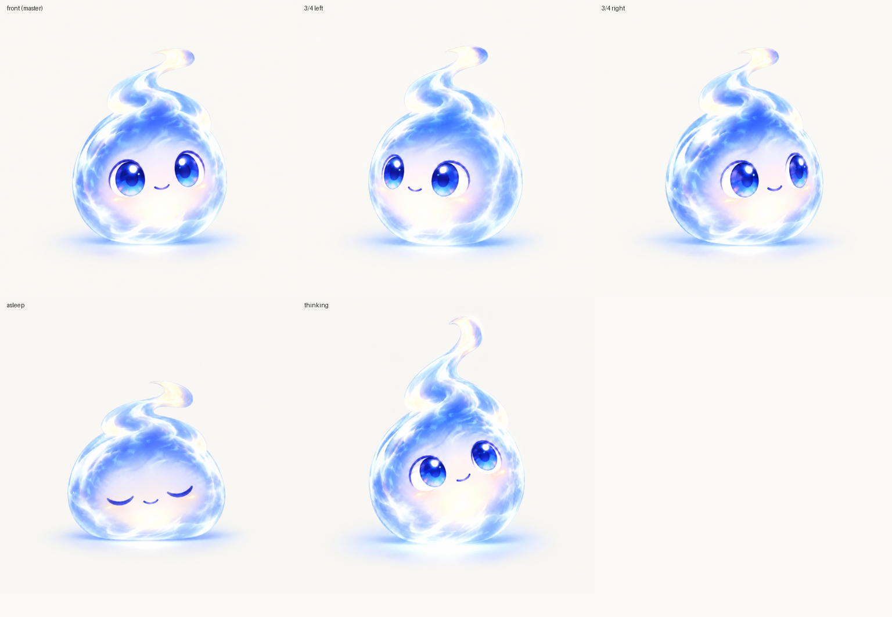

# Lumen

> 2026-09-10 定案。上游：[45](./45-陪伴的形态.md) 是形态的证据与法律边界，[61](./61-palace与desk.md) 是 palace 与 desk，[48](./48-记忆：观察与statement.md) 是观察与 statement，[55](./55-legion.md) 是 run 与调度，[north-star/companion.md](./north-star/companion.md) 是形象那一层的愿景。
>
> 取代关系：[45](./45-陪伴的形态.md) 的「第一版做什么」（一个球就是全部陪伴）作废，45 的各节证据、「法律边界」和「将来升到形象时已知的」不动；2026-08-26 那张「电电」概念图定的八种情绪、五套日常动作、token 喂养的能量条全部作废。第三轮调研的结论吸收进本文（[round3-01](./assets/companion-research/round3-01-motion-controllers.md)、[round3-02](./assets/companion-research/round3-02-rig-and-motion-data.md)、[round3-03](./assets/companion-research/round3-03-ipad-runtime.md)、[round3-04](./assets/companion-research/round3-04-behavior-layer.md)）。

---

## 是谁

Lumen 是 soul（[61](./61-palace与desk.md)）在空桌前的样子，不是另一只吉祥物。同一份记忆、同一条对话尾、同一套工具；桌上没有材料时的那次装配就是它，门（`src/soul/door.ts`）就是和它说话。代码和界面里叫 Lumen，中文对话里可以叫卢明。

它取代 2026-08-26 的「电电」。身体、眼睛、笑和头顶那簇火苗从那张概念图上留下来，别的没留。

## 寓意

光与电，光电效应。读进来的是光，理解出去的是电。身体本身是光，闲着也在亮；思考是电，核心变亮。

## 关系

它表达三件事：soul 的注意力在哪，它这会儿干得多重，以及对读者在材料上下的功夫的一声回应。

它不表演关系。没有想念，没有孤独，没有亲密度，招呼不随「多久没来」变化。摸它有反应——被打扰，看你一眼——不是高兴。

法律上这条线在 SB 243。一个有姿态的身体坐实 §22601(b)(1) 的「拟人特征」，唯一的出口仍是 §22601(b)(2)(A) 的 "only ... productivity and analysis related to source information"，词汇表只有注意力、用力和对材料的回应的身体还在里面，有亲密度和思念 idle 的身体不在。纽约 GBL §1700(4)(a)(ii) 管的是主动问情绪类问题，动作不问问题，但加一段委屈动画的那个念头也会加「你好久没来了」这句话。两部法今天对这个 app 都休眠（管辖挂用户所在地，见 45），这是现在选的约束，不是现在的义务。

## 形象



留下的：半透明蓝白光的圆胖身体，核心发亮；头顶一簇向一侧卷的火苗，剪影的签名；一对大而带高光的眼睛。

嘴有三个形状：闭着的小笑嘴、一条平线、一个小圆口。平线是在想，小圆口是在说，别的时候是笑嘴。小圆口的高度跟电平走，不做口型同步——10 Hz 的包络一个音节两个采样，按它选形状就是提线木偶。

眉毛只在两种时候存在：想和卡住。两笔细的深色短线，250 ms 淡入，其余时候整个不画——常驻的眉毛会让静止的脸带上表情，而静止的脸就是参考图那张。

去掉的：额头的闪电、底座充电台、四散的星点、手臂、能量条。

轨道环连同环上的电子画过一轮又去掉了：它的含义还没想好，一个绕着身体转的东西会把视线拉走。这条进待定，不是否掉。

配色上 app 是纸（`#faf9f6`）加墨（`#252922`）、绿只画线（[52](./52-配色.md)），Lumen 是画面里唯一发光的蓝白物体。app 今天没有暗色模式。

参考图和提示词留档在 [assets/lumen/](./assets/lumen/)。风格是打磨过的 2.5D 插画、柔和的体积光、没有硬描边。3/4 那两张只转眼睛加身体侧倾，2.5D 的转身照这个做。睡着是身体压低摊宽、火苗垂下、光变暗；思考是火苗更高、核心更亮；听不需要单独的参考图，身体和火苗前倾就是。

## 状态对应真实事件

每一个看得见的状态背后都有一个真的系统事件。没有事件的状态不做，概念图上的「好奇」「惊喜」「开心」因此删掉。

| 状态 | 事件 |
|---|---|
| 呼吸着的 idle | 什么都没发生 |
| 听 | 麦克风电平，10 Hz 的 level 事件 |
| 想 | 一次模型调用在飞 |
| 说 | TTS 包络 |
| 干活 | 一次工具调用或一个 legion run 在飞（[55](./55-legion.md)） |
| 睡 | 夜里的 dream 与蒸馏在跑（[48](./48-记忆：观察与statement.md)、[58](./58-蒸馏器与dream.md)） |
| 找到了 | 刚蒸出一条观察 |
| 卡住了 | 模型在意图里自己说的 |

## 四段

Lumen 不是在四个状态之间切画面，是演四段：看着你、抬头想、低头扫一眼桌面、回头说。一整轮读起来是这四句。段与段之间 200–350 ms 化过去（`ACT_EASE_MS` 280 ms），不切。眼睛的朝向和三个嘴形负责讲，别的动作一律小。

段由 orb 的 phase 加 `attention` 决定，`OrbPhase` 不加成员。

- 听（`listening`）：身体和火苗前倾，眼睛睁大盯住读者，idle 的漂移停掉——不动就是在听。麦克风电平只让火苗抖，身体不随电平胀。
- 想（`thinking` + attention 在 reader）：眼睛往上偏一侧，嘴变平线，眉毛淡入，火苗立起来（scaleY 1.18，绕根部），核心变亮，三秒周期的慢左右摇。
- 查（`thinking` + attention 在 work）：眼睛落到桌面上，左右快扫两个来回（每跳 120 ms），然后一个停顿；眉毛还在。attention 回到 reader 就抬眼看回来。这一段可跳过：一轮里 attention 从没去过 work 就不演，桌上没事还低头看是假的。
- 说（`speaking`）：眼睛看着读者，眉毛没了，嘴变小圆口，开口度跟 TTS 包络走 0.15–1.0，用 orb.ts 那套快起慢落的平滑，静音后按 `SILENCE_HOLD_MS`（450 ms）保持再闭上，词间的停顿不会让嘴一开一合。火苗跟同一个信号抖。每一句开头身体压一下再弹回来（`BOUNCE_MS` 120 ms，reduced motion 下不做）。

喂"说"这一段的是那条包络不是麦克风：通话期间麦克风一直开着，它报的是屋里的声音，照它开嘴就是冲着旁边最响的东西开。包络按句从 Swift 过来（33），到 WebView 按本地时钟回放（`src/ui/components/lumen/envelope.ts`），一句的开头就是弹跳的触发；别的段仍然读麦克风电平。`attention` 还是没接：会话只报四个 phase，SoulIntent 还没接，实机跑不到"查"这一段，只有 harness（`window.__orbStub.attention`）能驱动。

## 意图

soul 每一轮随正文一起发四个字段，不额外调一次模型，不开流式通道：

```ts
export interface SoulIntent {
  attention: "reader" | "work" | "away";
  energy: 0 | 1 | 2 | 3;
  posture: "settle" | "sit" | "alert" | "stretch";
  beat?: "ack" | "found" | "stuck" | "done";
}
```

没有叫 emotion 的字段。缺席合法，控制器照跑。

别的全部来自 app 已有的信号：orb 的四个 phase、电平、工具与 legion 活动、预算压力、还没说出口的观察、触摸。

同一个刺激重复出现要衰减响应，控制器给每种刺激留一个计数器，隔几分钟恢复。依据是猫的 head-turn 数据：重复七次后响应降到 50% 以下，稳定在约 32%（[round3-04](./assets/companion-research/round3-04-behavior-layer.md)）。

## 身体怎么动

2D/2.5D。一层永远在跑的背景动画，加若干条短的触发层混上去，这是 Disney BD-X、Duolingo Lily 和 Anki Vector 共同的形状。触发层由上面那四个字段和 app 的信号选，动作是画好的，模型不生成动作。不重复靠噪声驱动的 idle 和触发层的随机变体买，不靠堆资产。

不做 3D：仓库里没有 3D 渲染器，加一个要压在 pdfium.wasm 上，而团子不需要物理正确的行走。不做学习型控制器：公开的四足数据只有一份 30 分钟的真狗 mocap，它买来的是写实狗步态，正好毁掉风格化。

控制器是没有 React 的算术，落 `.ts` 配单测，登记进 `tests/layering.test.ts` 的 LAYER 表，先例是 `src/ui/components/orb/orb.ts`。

第一个里程碑是把参考图切层，用 CSS 加 rAF 驱动呼吸、眨眼、视线和 phase，替掉 `VoiceOrbEntry` 里现在那个球。运行时目标是 Rive：运行时是 MIT，可以进公开仓库；骨骼加网格变形给出 2.5D 的转身；状态机的输入正好是枚举、数值和 trigger。Live2D 按许可进不了这个仓库。

## 位置与尺寸

两处。门那一层放大的，桌上什么都没有。info 简报里现在球占的那个角上放小的，72 px。

角上那个盒子通话期间不再变大也不再居中。原来它会长到 160 px 挪到屏幕中间，等于每次通话开场都把一个身体甩到正在讲的东西上面。四段在 72 px 上都读得出来（56 px 上眉毛糊成一团、平嘴和笑嘴分不开），所以就待在角上。

它永远不出现在打开的书的正文旁边。45 里「动画放在叙事文字旁边把注意力拉走」的证据仍然有效，空桌这个形态绕开它，不推翻它。

## 声音

TTS 的音色挑轻一点、更合成一点的。一个可爱的非人身体配一把完全像人的嗓子读起来更瘆人（Mitchell et al.，i-Perception 2011，N=48，见 45 的调研）。挑哪一把没定。

## 待定

- 轨道环的含义。想清楚了才画回去。
- reading 侧的聊天入口要不要也露 Lumen 的脸。
- 声音的音色。
- iPad 上的帧时间和功耗，第三轮标为未实测的那两项。
- Rive 什么时候接替切层的位图。
