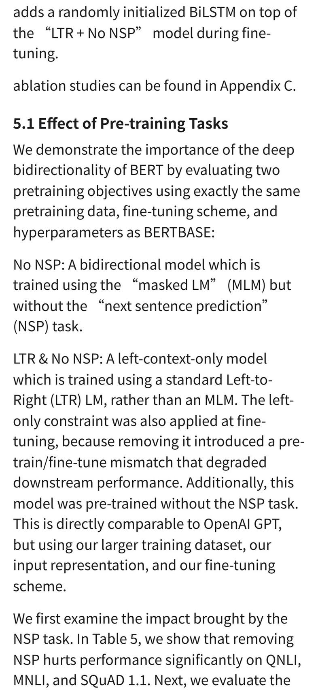
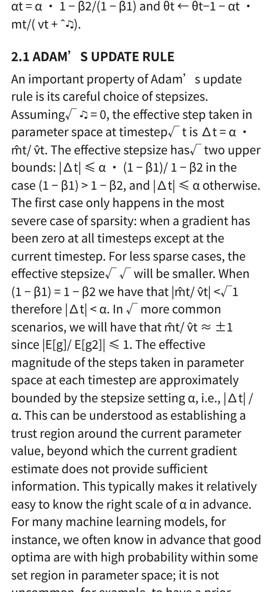
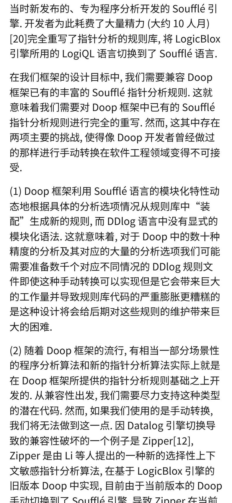
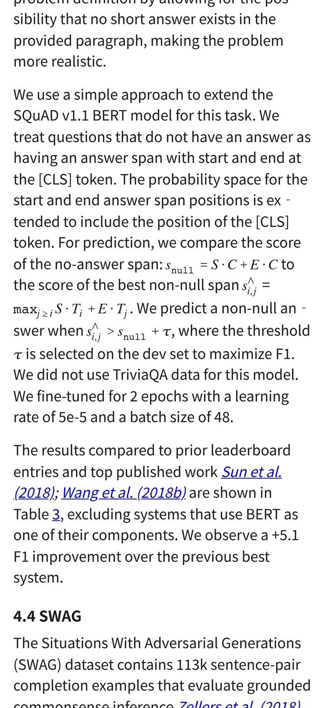

# PDF 正文重排到手机宽度

2026-09-22。回答一个问题：把论文正文从 PDF 里抽出来、在 393pt 宽的屏上重排，读不读得了。

原型用 pdf.js 的文本项做启发式版面分析，输出 HTML，按 iPhone 视口 393×852、DPR 3 截图。

## 1 结论

启发式重排在 arXiv 论文上能读：正文段落、阅读顺序、标题层级、图和图题在四篇样例上都立得住，393px 宽下没有横向溢出。卡在三处：公式全部退化成线性化的文本碎片（`√` 掉队、`ε` 渲染成 `♪`），表格只能整块当图、宽表在手机上看不清，标题页那种被居中元素切碎的版面会把摘要拆成一行一段。

## 2 四篇样例

| 代号 | 来源 | 版式 | 页 | 抽出正文字符 | 块 | 图 | 耗时 | 峰值内存 |
|---|---|---|---|---|---|---|---|---|
| p1-acl-2col | arXiv 1810.04805v2（BERT） | 双栏 NAACL | 16 | 60356 | 626 | 9 | 1.1 s | 448 MB |
| p2-single | arXiv 1412.6980v9（Adam） | 单栏 ICLR | 15 | 39923 | 335 | 4 | 0.9 s | 436 MB |
| p3-icml-2col | arXiv 1801.01290v2（Soft Actor-Critic） | 双栏 ICML，多子图 + 算法框 | 14 | 47621 | 377 | 9 | 2.0 s | 579 MB |
| p4-cjk | 软件学报 2024, 35(6): 2608–2630（DDoop） | 单栏中文期刊 | 23 | 45671 | 376 | 14 | 6.1 s | 1193 MB |

耗时含 pdf.js 渲染每页到 node-canvas（scale 2.0）。内存是 Linux x64 上 bun 的 RSS，不代表 iPhone。

### p1 双栏会议论文

对的：栏序正确，正文连贯，跨页续段接上了，行尾连字符去掉了（`down-` + `stream` → `downstream`），页眉「BERT: Pre-training…」十五处全部剔除，`4.2 SQuAD v1.1` 这类编号标题认成了 h3，Table 1 的图题跟着表走。

错的：

- 标题页的摘要一行一段。摘要被居中的标题、作者、机构切成很窄的带，每条带里只剩一两行，段落合并规则在带内没有上下文。
- 参考文献每条被切成两三段，作者名和期刊名交错（`ning, and Quoc Le. 2018. Semi-supervised se- Alan Akbik, ...`）。双栏参考文献列表的栏缝在这几页没检出，退回了单栏，左右两栏按 y 交替。
- Table 6 上方三条横线被当成图切出来了（切出的图里只有三根线），表体本身混进了正文（`#L = the izing these findings to deep bidirectional architec-`）。无框线表格既圈不出区域，也不是图。

### p2 单栏预印本

对的：标题、作者、Abstract、`1 INTRODUCTION` 层级正确；Algorithm 1 的伪代码逐行留在正文里，`while θt not converged do`、`mt ← β1 · mt−1 + (1 − β1) · gt` 这样的行是能读的；页脚「Published as a conference paper at ICLR 2015」剔干净。

错的：

- 行内公式最糟。`the effective stepsize√ √ will be smaller`：根号符号是独立文本项，被并进了错误的行；`ε` 字形映射不到 Unicode，输出成 `♪`。
- 编号显示公式没有单独成块，和前后句子连在一行。
- 54 块判成脚注，多数是页底的图注碎片和数学上下标行。真脚注只有两条。
- Algorithm 1 的标题和它下一句在版面上是跨两行的说明，被拆成两段。

### p3 双栏 + 多子图 + 算法框

对的：栏序正确；`5. Experiments` 这类标题认得出；六张训练曲线子图都切出来了，图例的小色块在扩框之后进了裁图。

错的：

- 子图是一张一张切的，一行三张的横排在手机上变成上下三张，`(b) Walker2d-v1` 这种子图标题和它的图错位一格。
- 坐标轴刻度数字在扩框之前被当成正文抽走过；扩框后大部分回到裁图里，但 y 轴标题这种离得远的仍然丢。
- 整篇的 Figure 图题只认出 5 条，另几条被并进了正文段。
- 算法伪代码框有外框线，整块被当成图切出来了。比 p2 的「留成文本」好看，但不可选中、不可划线。

### p4 中文期刊

四篇里视觉质量最好的一篇。

对的：段落极干净，没有因为中文不带空格而拼错行；`2.2.2 语法结构重写` 认成标题；`图 5 框架后端架构` 的图题贴在图下面；图整块切得完整；摘要、关键词、中图法分类号各自成段。

CJK 特有的问题：

- 字间距靠 pdf.js 的 `width` 判空格，中文标点前后偶尔多一个空格。换行处用「前后都是 CJK 就不插空格」的规则挡住了大部分，漏的是标点和拉丁文混排的边界。
- 63 块判成 h3。中文期刊里大量单行短段（表格行、图内文字、参考文献条目）满足「单行 + 短 + 以数字开头」，启发式分不开。英文三篇这个数是 5 到 10。
- 字号判断上，CJK 文本项的 `transform` 是 `[7.92, 0, 0, 12, x, y]`：水平缩放 7.92 和字号 12 不是一个数。用 `hypot(t[2], t[3])` 取到 12 是对的，用 `t[0]` 会系统性偏小。
- 该文正文里 ASCII 半角逗号加空格是原文如此，不是重排造成的。

## 3 映射表

每个块记两层坐标，都在 PDF 用户空间（点，原点左下）：

- `rects`：行级矩形，`[{p, x0, y0, x1, y1}]`，一条一行。
- `spans`：文本项级，`[fromChar, toChar, pageIndex, x0, y0, x1, y1]`，字符区间对一个 pdf.js 文本项的包围盒。

| 文件 | 正文字符 | 块 | 行矩形 | 项级 span | 每 span 字符 | map.json | gzip |
|---|---|---|---|---|---|---|---|
| p1-acl-2col | 60356 | 626 | 1399 | 2563 | 23.5 | 207 KB | 49 KB |
| p2-single | 39923 | 335 | 643 | 4657 | 8.6 | 230 KB | 67 KB |
| p3-icml-2col | 47621 | 377 | 967 | 2528 | 18.8 | 169 KB | 44 KB |
| p4-cjk | 45671 | 376 | 829 | 5578 | 8.2 | 277 KB | 78 KB |

粒度是文本项级，不是字符级。一个 span 平均管 8 到 24 个字符。落到单字要在 span 内按 `width` 线性插值，等宽字体准，比例字体会偏；CJK 因为等宽，插值基本准。真正的字符级要 pdf.js 把每个字单独交出来，只有开 `disableFontFace` 之类的路子或者自己按字体度量拆，代价是文本项数量涨一到两个数量级，映射表跟着涨同样的倍数。

体积：未压缩 169–277 KB，gzip 后 44–78 KB，是重排 HTML（53–96 KB）的同一量级，比原 PDF（572 KB–7.4 MB）小。一本书按这个比例存得起。

回验：随机取 17 段正文的中段 60 字，按 span 反查 PDF 矩形再读回文本，13 段字面吻合（中文 6/6，p1 4/6，p2 3/5）。4 段不吻合的返回了同一段但起点偏移的文本，没有分清是映射错还是这个粗比较的问题。

## 4 arXiv HTML 版

### 四篇样例

| 论文 | `arxiv.org/html/<id>` | 公式 | 图 | 结构 |
|---|---|---|---|---|
| 1810.04805v2 | 有，263 KB | MathML，111 个 `<math>`，每个带 `annotation encoding` 的 LaTeX 原文 | 6 个 ``，`https://arxiv.org/html/1810.04805v2/x1.png` 直接 200 拿得到（182 KB PNG） | 45 `<section>`、120 `
`、13 `<figure>`、9 `<table>`，规整 |
| 1801.01290v2 | 有，259 KB | MathML，173 个 | 10 个 `` | 26 `<section>`、77 `
`、22 `<figure>`、23 `<table>` |
| 1412.6980v9 | 没有。返回 200 但正文 3661 字符、`<title>Untitled Document</title>` | — | — | — |
| 软件学报那篇 | 不在 arXiv | — | — | — |

带版本号和不带版本号返回的字节数完全一致。

把 BERT 的 HTML 版剥掉 arXiv 自己的样式、套上和重排同一份手机 CSS 渲染，正文质量明显高于启发式重排：段落是原始段落，不存在栏序和拼行问题，公式是 MathML 排出来的真公式，交叉引用是可点的链接。两处不如：22 个元素横向溢出 393px（宽表格和长公式）；LaTeXML 把脚注正文内联进了段落中间（`available,1212 12 QANet is described in Yu et al. (2018), but the system has improved substantially after publication. and are al-lowed to use any public data…`），读起来是断的。

### 覆盖率

抽样方法：arXiv API 按分类查 `submittedDate` 落在 2024-01-01 到 2026-09-01 的投稿，每类取 60 条，按固定下标 0/11/23/37/52 取 5 篇；四个分类 cs.LG、math.AP、physics.optics、q-bio.NC。两个队列：一次按日期降序（取到 2026-08/09 的新论文），一次按升序（取到 2024-01 的论文）。共 40 篇。判「有」的条件是 HTTP 200、去标签后正文超过 8000 字符、`<title>` 不是 `Untitled Document`。

| 队列 | cs.LG | math.AP | physics.optics | q-bio.NC | 合计 |
|---|---|---|---|---|---|
| 2026-08/09 | 5/5 | 5/5 | 5/5 | 3/5 | 18/20（90%） |
| 2024-01 | 5/5 | 5/5 | 2/5 | 3/5 | 15/20（75%） |
| 总 | 10/10 | 10/10 | 7/10 | 6/10 | 33/40（82.5%） |

没有的那 7 篇：2026 队列 2 篇返回 404，2024 队列 5 篇返回 404。旧论文是另一种情况，arXiv 回填过一部分，命中与否看得到源不看年份（两篇样例里 BERT 有、Adam 没有）。这个 40 篇样本不覆盖 2023 年 12 月之前的论文。

HTML 版存在时质量胜过启发式重排一大截，但 2024 年以后也有六分之一到四分之一拿不到，2023 年底以前基本要碰运气，中文期刊完全没有。重排是兜底那条，不是二选一。

## 5 坑

两条已编号：[377](../pitfall/storage/377-arxiv-html-returns-a-200-shell.md)（`arxiv.org/html/<id>` 没有 HTML 版时可能返回 200）、[378](../pitfall/pdfjs-extract/378-a-full-page-bitmap-watermark-derails-graphic-detection.md)（中文期刊 PDF 的整页位图水印把图形检测带偏）。

其它实测行为，没给编号：

- pdf.js 4.10 在 bun 里 `isNodeJS` 判 false，`getDocument` 默认拿 `DOMCanvasFactory` 去摸 `globalThis.document`，渲染在 `endGroup` 里报 `TypeError: Image or Canvas expected`。要传 `getDocument({ CanvasFactory })`，大写 C，传的是类不是实例；`page.render({ canvasFactory })` 那个小写参数在 4.10 不生效，渲染用的是 transport 上那一份。
- NAACL/ACL 模板的栏缝只有 14 pt，占 A4 页宽（595 pt）的 2.4%。按「空白带超过页宽 2.5%」判栏在这个模板上全页失败；再叠上分箱时 `Math.ceil` 多染一格，实际可用宽度只剩 11 pt。阈值要压到 1.2% 左右。
- 分栏检测必须先剔掉图内文字和跨栏元素，否则一张跨栏图的坐标轴标签就把栏缝填死，那一页退回单栏、左右交替。单页检测不够，BERT 16 页里 6 页因为图和标题检不出栏缝，要在文档级取共识（多数页同意的栏缝位置套到全文）。
- pdf.js 把上下标当独立文本项交出来，基线偏移常常超过行分组容差，会各自成行。要先按正文字号分组成行，再把小字号项按基线落进最近的行，否则 `st`、`nd`、`−8` 这类碎片会变成独立段落（BERT 和 Adam 上各出现几十个）。

## 6 没做到

iPhone 上一次没跑；没打成 EPUB 喂给 `flow-view.ts`；扫描版 PDF 一篇没试。

## 7 这份提取对课堂形态意味着什么

手机上打开 PDF 直接进课堂（[north-star/phone-reading](../north-star/phone-reading.md)），课堂吃的是正文，不显示版面。上面三处错法因此落在不同的位置：

- 公式线性化、无框线表格散进正文、标题页摘要被切碎，都是版面上的错。课堂不显示版面，拿到的是同一串正文字符，不受影响。栏序、跨页续段、连字符、页眉剔除这几件立得住，才是课堂真正依赖的。
- 图和表在课堂里是缺口而不是错误：正文提到「见图 5」时，课堂没有东西可以指。
- 扫描件没有文本层，抽不出正文，这条线在扫描件上仍然不行，和重排质量无关。
- arXiv HTML 版存在时正文质量更高，课堂优先吃它；覆盖率 82.5%，中文期刊和旧论文只能落回 pdf.js 提取。
