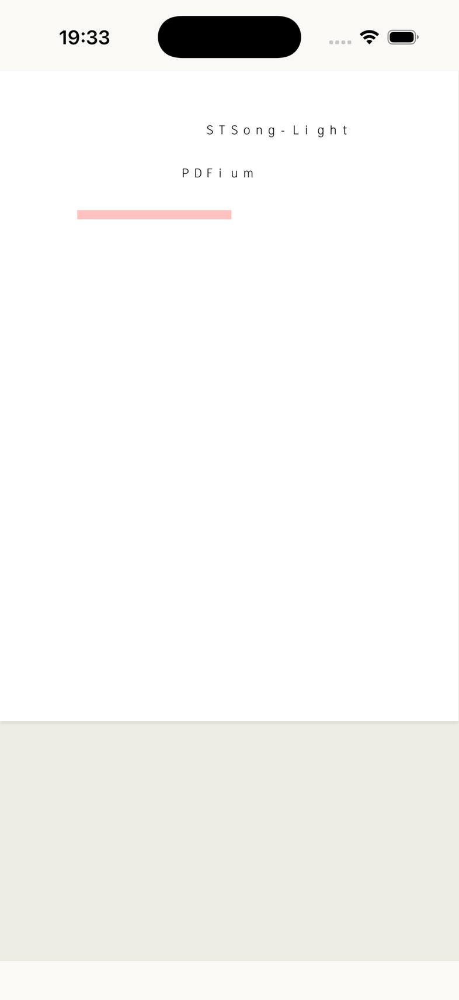

# PDFium WASM 在 iPhone 模拟器上的实测

2026-09-22。回答一个问题：现有阅读引擎（EmbedPDF + PDFium WASM）能不能在 iPhone 的 WKWebView 里跑。

能用，有一处硬伤：不嵌字体的中文 PDF 一个汉字都不画（[坑 376](../pitfall/embedpdf/376-a-cjk-font-that-is-not-embedded-renders-nothing.md)）。

引擎本身在 iPhone 17 模拟器的 WKWebView 里没有任何异常：worker 引擎起得来、不走回退，40MB / 45 页的论文 0.4 秒出第一页，翻页一两百毫秒，真手指滚动中位帧 17ms，pinch 放大到 3.5 倍正常。两个真正的问题不在引擎：fit-width 下正文只有 1.1mm 高，是手机正文字号的四成，不放大读不了；单开一本论文 WebContent 进程的 phys_footprint 峰值 700-760MB，模拟器不管，真机 jetsam 管。

测试环境：iPhone 17 模拟器（udid F7D3DAF8…C80A）、iOS 26.5、Mac mini。视口 402×874 CSS px，devicePixelRatio 3，`crossOriginIsolated` false、`SharedArrayBuffer` 不存在。走 `tauri ios dev` 的真包，页面是引擎测试页 `embedpdf-spike.html`（手机壳今天拒开 PDF，没走壳）。三份被测文件：`demo.pdf`（14 页 / 1.0MB）、arXiv 1706.03762 Attention（15 页 / 2.2MB / 带矢量图）、arXiv 2112.10752 Latent Diffusion（45 页 / 40.8MB / 重位图）。

## 1 引擎起不起得来

起得来。`window.__pdfiumEngineMode` 是 `"worker"`，和坑 21 在 macOS 上的结论同一条路径：blob worker 里 fetch `tauri://localhost/pdfium/pdfium.wasm` 成功，探针过，不回退主线程。iPhone 上没有新的启动问题。

冷开时间，每份文件三次，取中位数。FCP 是 navigationStart 到首帧有内容（页面在第一页画出来之前是空白，所以它就是「打开到能看见一页」）；firstImg 是 harness 自己的埋点，React mount 到 `#root` 里出现第一张页图。

| 文件 | 页数 | 字节 | FCP 中位 (ms) | 三次 FCP | firstImg 中位 (ms) | DOMContentLoaded (ms) |
|---|---|---|---|---|---|---|
| demo.pdf | 14 | 1.0MB | 417 | 427 / 392 / 417 | 351 | 38-73 |
| paper (1706.03762) | 15 | 2.2MB | 308 | 314 / 276 / 308 | 354 | 40-54 |
| big (2112.10752) | 45 | 40.8MB | 387 | 399 / 361 / 387 | 479 | 39-55 |

拆开看钱花在哪（`__loadTimeline`，直连引擎，demo.pdf，三次）：

| 段 | ms |
|---|---|
| fetch PDF 字节 | 4-6 |
| 建引擎（第一次，wasm 已在 HTTP 缓存） | 26-31 |
| openDocumentBuffer 解析 | 3-6 |
| 建引擎（第二次） | 20-24 |
| 解析（第二次） | 3-4 |

400ms 里只有 40ms 是引擎和解析，其余全在 layout 加首页光栅，和 Chromium 桌面上量的结构一致，只是绝对值大一截。40MB 的文件比 1MB 的只慢 100ms 左右，瓶颈不是字节数。

## 2 翻页

从 `navigateToPage(n)` 调用到 stats 的 pageIndex 到位且屏上出现一张新光栅的图。

| 文件 | 翻到第 10 页 | 翻到最后一页 | 翻回第 1 页 |
|---|---|---|---|
| demo.pdf (14p) | 142 | 112 (p14) | 113 |
| paper (15p) | 118 | 92 (p15) | — |
| big (45p) | 203 | 227 (p45) | — |

没有慢到要加载指示器的程度。45 页 40MB 那份跳到最后一页 227ms，是三份里最慢的。

## 3 内存

模拟器上的数字，用 macOS 的 `footprint` 读 `phys_footprint`。app 进程是 Tauri 的 Rust 壳，WebContent 是 WKWebView 的渲染进程，后者是 jetsam 真正盯的那个。每组都先 `simctl terminate` + `launch` 拿干净的进程再测。

| 状态 | app | WebContent | WebContent 峰值 |
|---|---|---|---|
| 刚启动、还没开 PDF | 45MB | 158-162MB | 158-162MB |
| paper 开一次 | 52MB | 380MB | 696MB |
| paper 连开三次 | 50MB | 669MB | 788MB |
| paper 真手指滚五下 | 53MB | 377MB | 705MB |
| paper 放大到 3.5 倍 | 96MB | 492MB | 705MB |
| big 开一次 | 88-89MB | 454-462MB | 739-758MB |
| big 翻到第 10 页 | 88MB | 643MB | 739MB |
| big 翻到最后一页 | 89MB | 610MB | 758MB |
| big 再翻十页 | 89MB | 599MB | 758MB |
| big 连开三次 | 86MB | 772MB | 903MB |

读法：开一本书让 WebContent 从 160MB 涨到 380-460MB，开的那一瞬间峰值冲到 700-760MB。翻页把常驻推到 600MB 上下就不再涨（预取窗口有界，翻十页和翻一页一样）。app 进程只在 big 上多占 40MB，就是那份 40MB 的 ArrayBuffer。

「连开三次」那两行是同一个 WebContent 里重复 reload harness，772MB 说明重开一本书旧的光栅没有及时还回去。在 app 里换书走的是同一个 webview，这条值得再查。

模拟器的数字只能当量级参考：模拟器不跑 jetsam，WebContent 的 footprint 里混着宿主 macOS 的映射。真机上 WebContent 被杀的阈值比整个 app 的低得多，700MB 峰值在真 iPhone 上离线很近。

## 4 交互

真手指，走 idb 的 HID 通道和 XCUITest，不是合成事件。

竖向滚动：连续五次上滑（200,720 → 200,240，0.35s，6px/步），滚动位置从 0 走到 3178（总长 7089），落到第 7 页。同期用 rAF 量帧间隔：

| 指标 | 值 |
|---|---|
| 采样帧数 | 341 |
| 帧间隔中位 | 17ms |
| p95 | 29ms |
| 最大 | 79ms |
| 超过 32ms 的帧 | 14 / 341（4%） |

中位 17ms 是 60fps 满帧，掉帧集中在新页进入视野要光栅那几帧。手感不卡，会有轻微的顿。rAF 在 iOS 的滚动惯性期间可能被节流，这组数字偏乐观，真机上要用别的口径复核。

pinch 放大：`pinch out 2.0` 把 zoom 从 0.656 带到 2.32（3.5 倍）。放大后横向平移正常，scrollLeft 从 0 拖到 795（上限 1018），文字锐利、公式完整。但 DOM 里光栅是混着的：手势前就在屏上的页仍挂着旧位图（naturalWidth 1204 对 CSS 宽 1420，每 CSS 像素 0.85 个设备像素），新进视野的页按 dpr 3 重新出图，刚放大的那一页会软一下。

pinch 缩小走驱动脚本的坑，见 [坑 375](../pitfall/ios-build/375-pinch-in-needs-a-scale-below-one.md)；`pinch in 0.5` 不抛但 zoom 停在 2.32 回不来。驱动环境本身的坑见 [坑 374](../pitfall/ios-build/374-the-idb-venv-does-not-survive-tmp.md)。

## 5 长按选文字

没有选区。正文上长按 1.2 秒，`getSelection()` 为空，UIKit 辅助功能树里除 Application 根节点外什么都没有，没有 Copy / Look Up 那条 callout，截图上也没有选中高亮和放大镜。harness 这套插件配置下 `#root` 里一个 `span` 都没有，文本层根本不在 DOM 里（8 个 img、38 个 svg、76 个 rect）。

不能由此判定 iPhone 上选不了文字，只能说引擎测试页这套配置下长按不出选区。划词要在装了选区插件的壳里再验。

## 6 正文字号

两份论文的正文字框中位高 8.91pt（约 10pt 字），fit-width 时 zoom 是 0.657。

| | CSS px | 设备像素 | 物理高度 |
|---|---|---|---|
| 10pt 正文 @ fit-width | 6.6 | 19.7 | 1.09mm |
| 手机正常正文 17px | 17 | 51 | 2.82mm |

Letter 页宽压进 2.62 英寸的屏，线性缩到 30.8%。fit-width 下论文正文是手机正常正文的四成高，不放大读不了。这不是引擎问题，是排版和屏宽的算术。

## 7 渲染正确性

嵌了字体的中文（Noto Serif CJK 子集，CIDFontType0）简繁全对、无豆腐块，和 poppler 参考图逐行一致。矢量图（Transformer 结构图）、位图插图、公式与希腊字母全部正确锐利。

没嵌字体的中文汉字全部消失，同一行的 ASCII 照常画出，`openDocumentBuffer` 正常 resolve、pageCount 对、error 是 null、控制台一行都没有。归因：引擎以 `fontFallback: null` 创建，而 pdfium.wasm 不带 CJK 字体；`fontFallback` 是一份字体清单不是开关，字体要宿主自己备自己喂。完整归因和摄入期的提前判据在 [坑 376](../pitfall/embedpdf/376-a-cjk-font-that-is-not-embedded-renders-nothing.md)。

## 8 上真机还差什么

按重要性：

- WebContent 的 `phys_footprint` 与 jetsam。模拟器上单开一本论文峰值 700-760MB，真机 WebContent 的配额比整个 app 低，判据是有没有收到 `webViewWebContentProcessDidTerminate`。
- 冷开时间。400ms 在真机上可能是 800ms 到 1.5s。
- 滚动帧率，用不受 iOS 惯性节流影响的口径。
- 发热和电量。

harness 页带不进真机包：`vite build` 只有 `index.html` 是 entry，两个 spike 页都是 dev-only，真机上 `/embedpdf-spike.html` 是 404。三条路：临时给 `build.rollupOptions.input` 加 entry 出 .dev 包（改动不许进 main）；真机连 Mac 的 dev server（要 `NSLocalNetworkUsageDescription` 和开发签名，测内存可以，测冷开不行）；在壳里加埋点（那道拒开 PDF 的闸本来也要开）。离线 .dev 包没有 sim-bridge，读数要靠 `devicectl` / Instruments 加 `idevicesyslog -m` 捞日志。
